# Building a Production-Ready Serverless App

## 1. Overview

In this codelab, you will learn how to build and deploy a fully functional serverless web application using Google Cloud. The application, a "Dog Finder", allows users to report lost dog sightings by uploading a photo and pinning the location on a map.

You will deploy the backend (a Python Flask application) to **Cloud Run**, store images in **Cloud Storage**, save application data in **Firestore**, and stream events through **Pub/Sub** into **BigQuery** for analytics.

### What you will build

A full-stack, serverless web application that:
- Authenticates users via Google Sign-In (OAuth 2.0)
- Accepts sighting reports with photo uploads and map-based location pinning
- Streams analytics events through Pub/Sub into BigQuery

### What you will learn
- How to set up a Google Cloud project and enable APIs
- How to provision serverless infrastructure (Cloud Run, Firestore, GCS, Pub/Sub, BigQuery)
- How to deploy a containerized Python application to Cloud Run
- How to build a real-time data pipeline from a web app into BigQuery
- How to create a Google OAuth 2.0 client for user authentication

### What you'll need
- A Google account (Gmail or Google Workspace)
- A credit card (for billing activation; the free trial covers all costs in this lab)
- Approximately **60–90 minutes**

---

## 2. Set Up Your Google Cloud Project

### Create a Google Account

If you don't already have a Google account, [create one here](https://accounts.google.com/SignUp).

### Create or Select a Google Cloud Project

1. Sign in to the [Google Cloud Console](https://console.cloud.google.com).
2. Click on the project selector dropdown at the top of the page.
3. Click **New Project**.
4. Enter a descriptive name (e.g., `dog-finder-codelab`). Take note of the auto-generated **Project ID** — you'll use it throughout this lab.
5. Click **Create**.

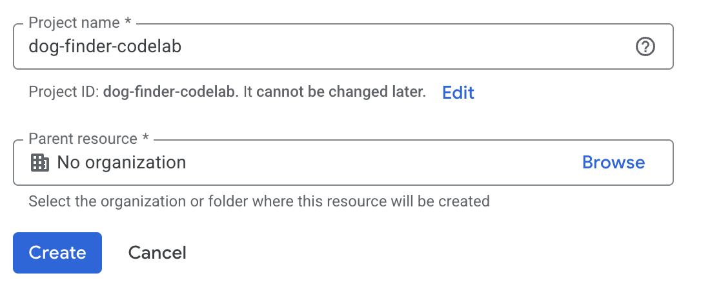

> **Note:** Your Project ID is different from the project name. The Project ID is a unique, permanent identifier (e.g., `dog-finder-codelab-123456`). You can always find it on the Cloud Console home page.

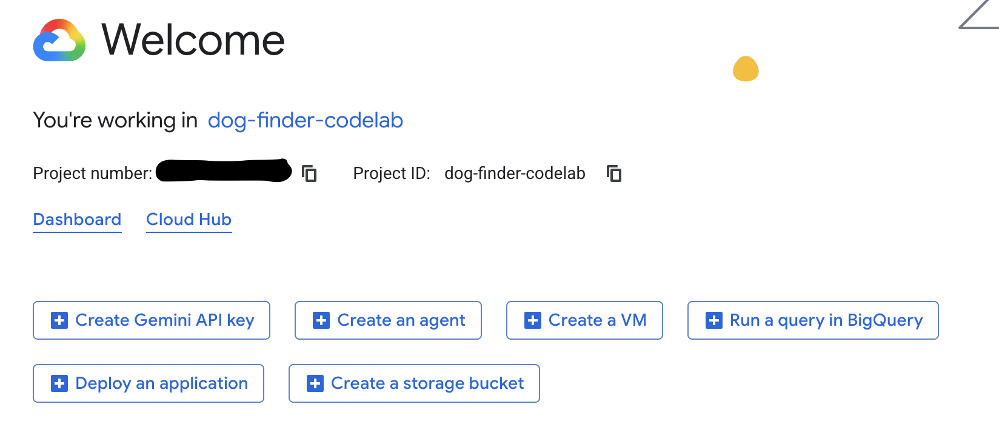

### Enable Billing

> ⚠️ **This step is required.** Cloud Run, Cloud Build, and several other services used in this codelab require a billing account linked to your project. Without it, the API activation step will fail.

New Google Cloud users are eligible for a **[$300 free trial credit](https://console.developers.google.com/billing/freetrial)** which is more than enough to complete this lab.

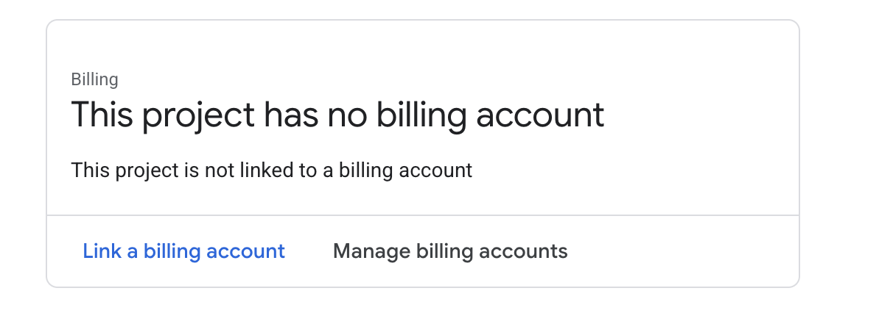

1. In the [Cloud Console](https://console.cloud.google.com), open the navigation menu (☰) and go to **Billing**.
2. Click **Link a billing account**.
3. Select an existing billing account or click **Create account** to set up a new one and activate the free trial.
4. Confirm the account is linked to your project — you should see your project name listed under the billing account.

> **Tip:** Don't forget to run the cleanup script at the end of the codelab to avoid any ongoing charges.

---

## 3. Enable Required APIs

With your project selected, enable all the Google Cloud APIs this application uses. Open [Cloud Shell](https://console.cloud.google.com/cloudshell) by clicking the **>_** icon at the top right of the console and run:

```bash
gcloud config set project YOUR_PROJECT_ID

gcloud services enable \
  run.googleapis.com \
  storage.googleapis.com \
  pubsub.googleapis.com \
  firestore.googleapis.com \
  bigquery.googleapis.com \
  cloudbuild.googleapis.com \
  maps-backend.googleapis.com \
  geocoding-backend.googleapis.com
```

> Replace `YOUR_PROJECT_ID` with your actual project ID.

This enables:
| API | Used for |
|---|---|
| Cloud Run | Hosting the Flask application |
| Cloud Storage | Storing uploaded dog photos |
| Pub/Sub | Streaming sighting events |
| Firestore | Storing user and sighting records |
| BigQuery | Analytics data warehouse |
| Cloud Build | Building the container image |
| Maps & Geocoding | Interactive map in the UI |

---

## 4. Get Your Credentials

This application requires two sets of external credentials that you need to obtain before configuring it.

### 4a. Create a Google Maps API Key

1. In the Cloud Console, go to **APIs & Services → Credentials**.
2. Click **+ Create Credentials → API Key**.
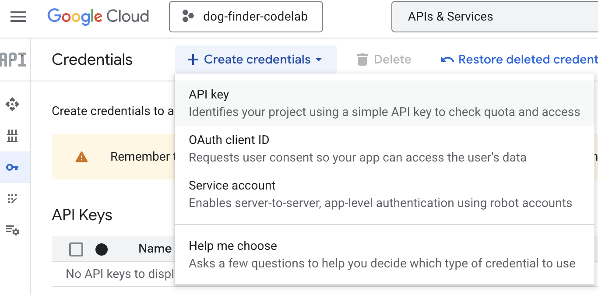
3. Restrict it to the **Maps JavaScript API** and **Geocoding API** to improve security.
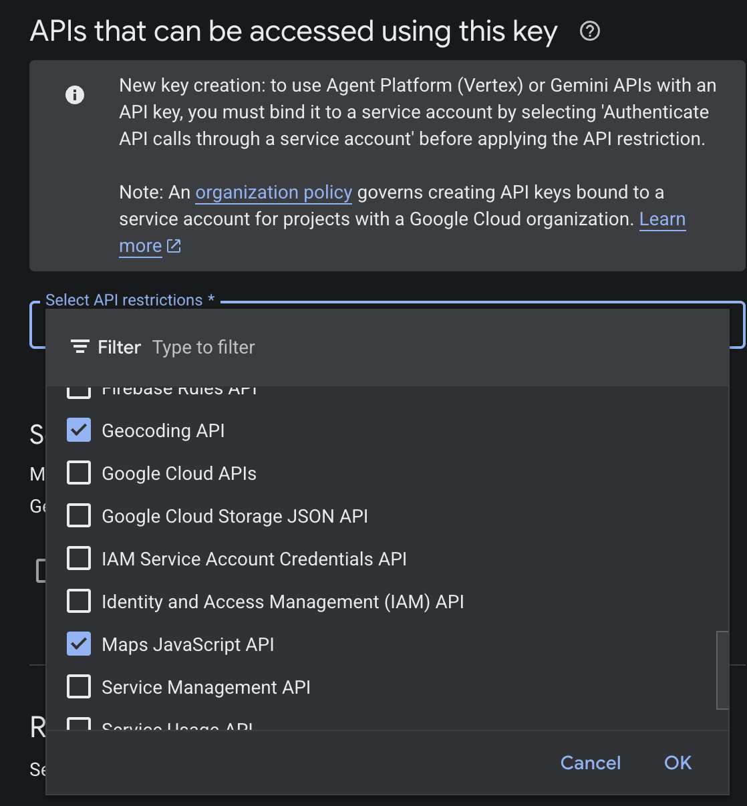
4. Copy the generated key and save it somewhere safe — this is your `GOOGLE_MAPS_API_KEY`.


### 4b. Create OAuth 2.0 Credentials (Google Sign-In)

The application uses Google OAuth 2.0 to let users log in with their Google account.

1. In the Cloud Console, go to **APIs & Services → Credentials**.
2. Click **+ Create Credentials → OAuth 2.0 Client ID**.
3. If prompted, configure the **OAuth Consent Screen** first:
   - Fill in an app name (e.g., `Dog Finder`) and your email address.
   - Set **User Type** to `External`.
   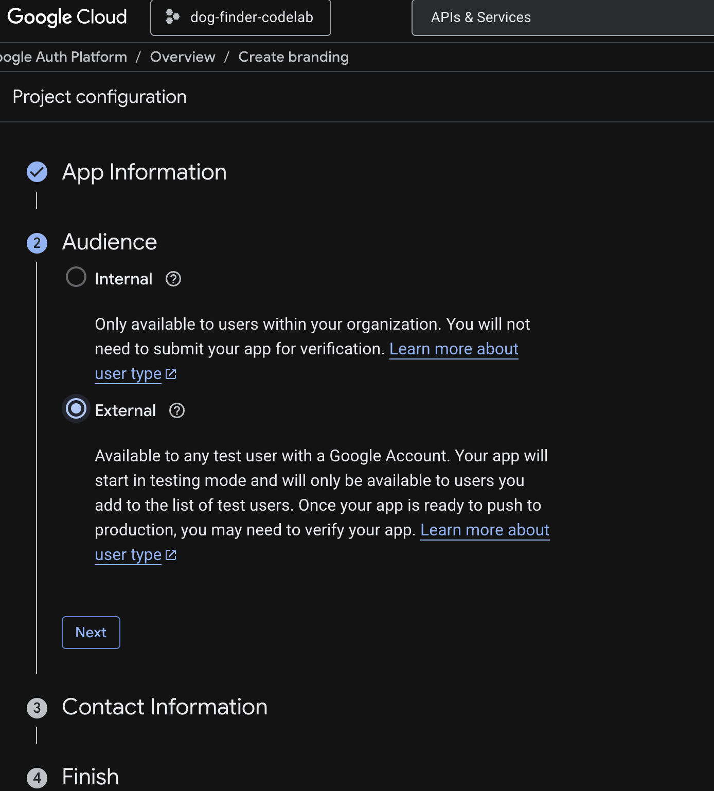
   - Click **Save and Continue** through the remaining screens.
   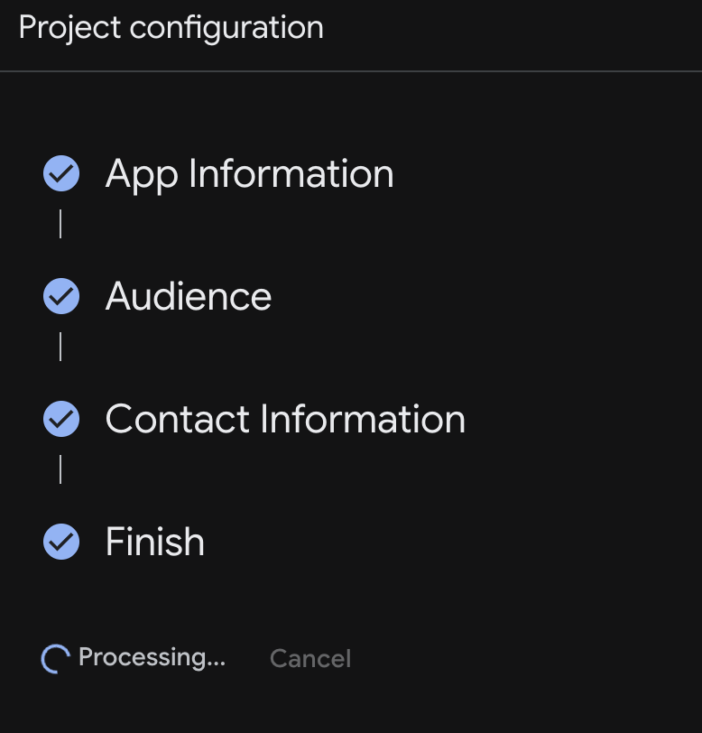
4. Back on the Credentials page, click **+ Create Credentials → OAuth 2.0 Client ID** again.
5. For **Application type**, select **Web application**.
6. Under **Authorized redirect URIs**, click **+ Add URI** and enter:
   ```
   http://localhost:8080/auth/callback
   ```
   *(You will add your Cloud Run URL here after deployment.)*
   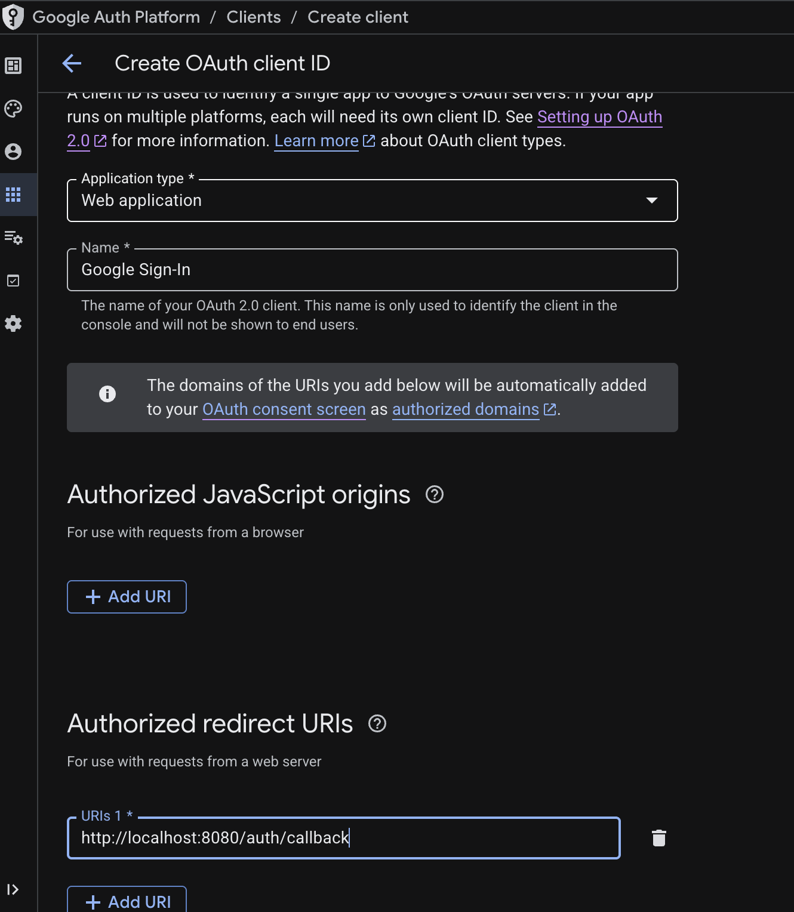
7. Click **Create**. A dialog will show your **Client ID** and **Client Secret** — save both.

---

## 5. Clone the Repository and Configure

### Clone the Starter Repository

In Cloud Shell (or your local terminal if you have `gcloud` installed):

```bash
git clone https://github.com/patricio-navarro/serverless_poc.git
cd serverless_poc
```

### Configure Environment Variables

The scripts and application rely on a `.env` file for configuration.

1. Copy the example file:
   ```bash
   cp .env.example .env
   ```

2. Open the `.env` file in the Cloud Shell editor (`edit .env`) or with `nano`:
   ```bash
   nano .env
   ```

3. Fill in the required values:

   | Variable | Description | Example |
   |---|---|---|
   | `GOOGLE_CLOUD_PROJECT` | Your GCP Project ID | `dog-finder-codelab-123456` |
   | `BUCKET_NAME` | A globally unique name for your image storage bucket | `dog-finder-images-abc123` |
   | `TOPIC_ID` | A name for the Pub/Sub topic | `dog-sightings-topic` |
   | `REGION` | The GCP region to deploy to | `us-central1` |
   | `BIGQUERY_DATASET` | The BigQuery dataset name | `lost_dogs` |
   | `BIGQUERY_TABLE` | The BigQuery table name | `publications` |
   | `SERVICE_NAME` | The Cloud Run service name | `dog-finder-app` |
   | `GOOGLE_MAPS_API_KEY` | Your Maps API Key from Step 4a | *(paste your key)* |
   | `GOOGLE_CLIENT_ID` | Your OAuth Client ID from Step 4b | *(paste your client ID)* |
   | `GOOGLE_CLIENT_SECRET` | Your OAuth Client Secret from Step 4b | *(paste your client secret)* |
   | `FLASK_SECRET_KEY` | A random string for session security | *(generate with `openssl rand -hex 32`)* |

   > **Tip:** To generate a secure `FLASK_SECRET_KEY`, run:
   > ```bash
   > openssl rand -hex 32
   > ```

4. Save the file (`Ctrl+O`, then `Ctrl+X` in nano).

---

## 6. Provision Infrastructure

A helper script provisions all the required cloud resources automatically.

```bash
./scripts/setup_resources.sh
```

**What this script does:**

| Step | Resource | Details |
|---|---|---|
| 1 | **Cloud Storage Bucket** | Creates the bucket and makes it publicly readable for image serving |
| 2 | **Pub/Sub Schema** | Creates an Avro schema to enforce the event message format |
| 3 | **BigQuery Dataset & Table** | Creates a time-partitioned table for sighting events |
| 4 | **Pub/Sub Topic** | Creates a topic linked to the Avro schema |
| 5 | **Pub/Sub IAM** | Grants the Pub/Sub service account `bigquery.dataEditor` (required for step 6) |
| 6 | **BigQuery Subscription** | Links the Pub/Sub topic directly to BigQuery for streaming inserts |
| 7 | **Firestore Database** | Initializes the default Firestore (Native mode) database |
| 8 | **Firestore Indexes** | Creates composite indexes needed for querying sightings |
| 9 | **IAM Permissions** | Grants the compute service account the Token Creator role (for signed URLs) |

> **Note:** Step 5 is critical — BigQuery subscriptions require the Pub/Sub service account (`service-PROJECT_NUMBER@gcp-sa-pubsub.iam.gserviceaccount.com`) to have `roles/bigquery.dataEditor` on your project. Without it, step 6 will fail with a permissions error.

---

## 7. Deploy to Cloud Run

With infrastructure in place, build and deploy the application container.

```bash
./scripts/deploy.sh
```

**What this script does:**
1. Uploads your source code to **Cloud Build** (Google's managed build service) and builds the Docker image entirely in the cloud — **no local Docker installation required**.
2. Deploys the built container to **Cloud Run** with all environment variables configured automatically.

Once the deployment finishes, the command will output a **Service URL** like:
```
https://dog-finder-app-xxxxxxxxxx-uc.a.run.app
```

**Copy this URL — you'll need it in the next step.**

### Verify the Deployment

To confirm the service is live, go to the [Cloud Run console](https://console.cloud.google.com/run), select your project, and check that `dog-finder-app` appears with a green checkmark and status **Running**.

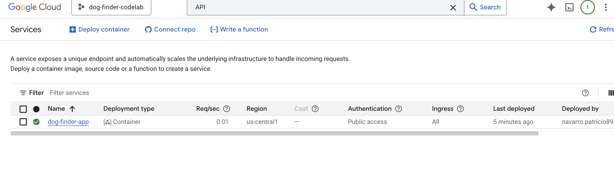

> **Note:** Don't open the app URL yet — the OAuth redirect URI still needs to be configured in the next step, or the login flow will fail.

### Update OAuth Redirect URI

Now that you have your Cloud Run URL, add it as an authorized redirect URI in your OAuth credentials:

1. Go to **APIs & Services → Credentials** in the Cloud Console.
2. Click on your OAuth 2.0 Client ID.
3. Under **Authorized redirect URIs**, add:
   ```
   https://<YOUR-CLOUD-RUN-URL>/auth/callback
   ```
4. Click **Save**.

---

## 8. Test the Application

1. Open your Cloud Run URL in a browser.
2. Click **Sign in with Google** and log in with your Google account.
3. Click **Report a Sighting**.
4. Fill in the form: drop a pin on the map, select a date, and upload a photo of a dog.
5. Submit the form — the sighting should appear on the homepage map and feed.

---

## 9. Tour the Architecture in the Cloud Console

After submitting your first sighting, take a few minutes to explore how data flows through each component — this is the heart of what makes the app serverless.

### 9a. Firestore — Application Database

Every sighting is stored in Firestore as a structured document.

1. Open the [Firestore Console](https://console.cloud.google.com/firestore).
2. In the **Data** tab, select the **`(default)`** database.
3. Click on the **`sightings`** collection — you should see a document for the sighting you just submitted, containing fields like `lat`, `lng`, `sighting_date`, `image_url`, and `timestamp`.

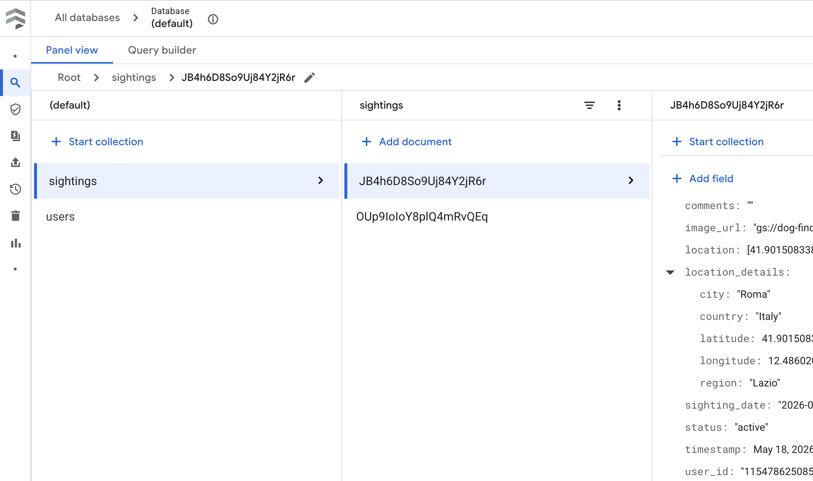

> Firestore is used here as the primary real-time store powering the **Find** tab map and feed.

### 9b. Cloud Storage — Image Bucket

Dog sighting photos are uploaded directly to Cloud Storage.

1. Open the [Cloud Storage Console](https://console.cloud.google.com/storage/browser).
2. Click on your bucket (e.g., `dog-finder-images-abc123`).
3. You should see the image file you uploaded, publicly accessible via a URL of the form:
   ```
   https://storage.googleapis.com/<BUCKET_NAME>/<filename>
   ```

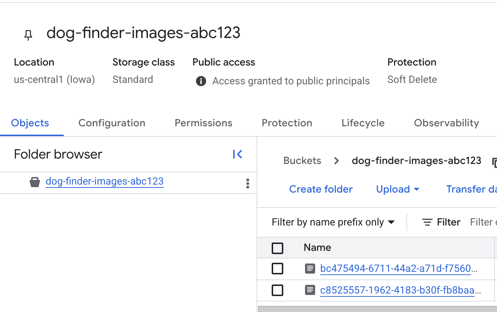

### 9c. Pub/Sub — Event Stream

Every sighting submission publishes a message to a Pub/Sub topic, which triggers the streaming insert into BigQuery.

1. Open the [Pub/Sub Console](https://console.cloud.google.com/cloudpubsub/topic/list).
2. Click on **`dog-sightings-topic`**.
3. Go to the **Subscriptions** tab and click on **`dog-sightings-topic-bq-sub`**.
4. Click **View messages** — you can pull recent messages and inspect the Avro-encoded event payload.

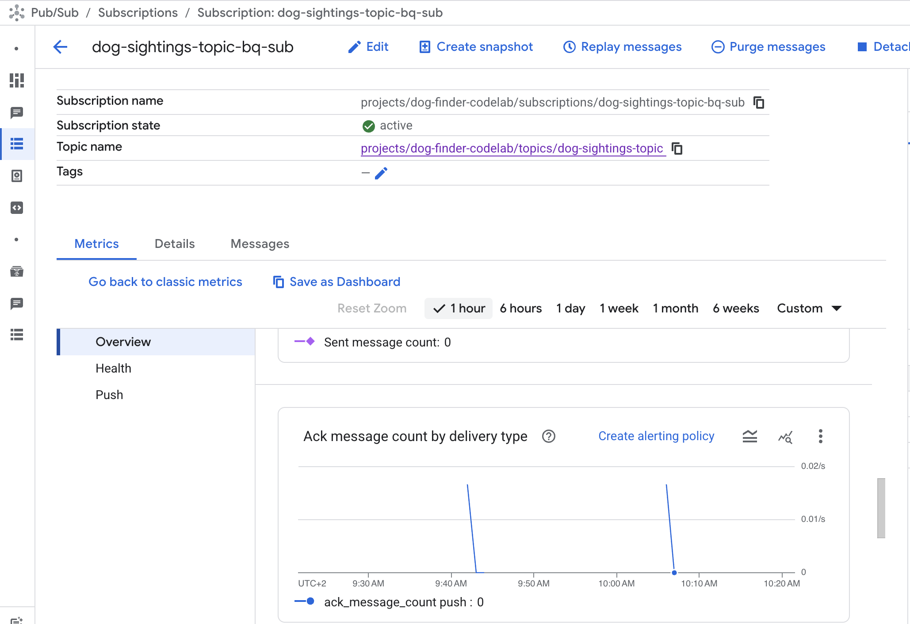
> The message schema is defined in `schemas/pubsub_schema.json` and enforced on every publish.

---

## 10. Verify the Data Pipeline in BigQuery

Every sighting submission publishes an event to Pub/Sub, which is automatically streamed into BigQuery.

1. Open the [BigQuery Console](https://console.cloud.google.com/bigquery).
2. In the left panel, expand your project → `lost_dogs` → `publications`.
3. Click on the table, then click **Query**.
4. Run the following query:
   ```sql
   SELECT *
   FROM `YOUR_PROJECT_ID.lost_dogs.publications` 
   LIMIT 1000
   ```
5. You should see the event data for the sighting you just submitted!

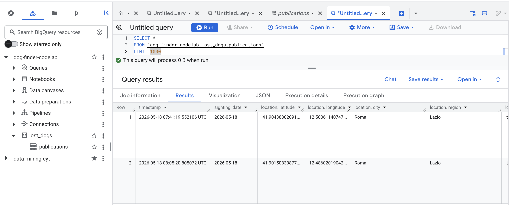
> **Note:** It may take up to 60 seconds for events to appear in BigQuery due to the Pub/Sub subscription delivery latency.

---

## 11. Clean Up

To avoid ongoing charges, delete all resources created in this codelab:

```bash
./scripts/clean_up.sh
```

> ⚠️ **Warning:** This script permanently deletes the Cloud Run service, Cloud Storage bucket, Pub/Sub topic and schema, BigQuery dataset and table, and the Firestore database.

You will be prompted to confirm before any resources are deleted.

---

## 12. Congratulations! 🎉

You've built and deployed a production-ready serverless application on Google Cloud!

### What you accomplished:
- ✅ Set up a Google Cloud project with billing and APIs
- ✅ Created Google Maps and OAuth credentials
- ✅ Provisioned Cloud Storage, Pub/Sub, BigQuery, and Firestore
- ✅ Deployed a containerized Python app to Cloud Run
- ✅ Explored each GCP service to understand how data flows end-to-end
- ✅ Verified a real-time data pipeline flowing from the web app into BigQuery

### Next steps:
- Explore the app's source code in the `app/` directory to understand how the services are integrated
- Try modifying the `load_test.sh` script to simulate sightings from different locations
- Build a Data Studio dashboard on top of the BigQuery `publications` table
