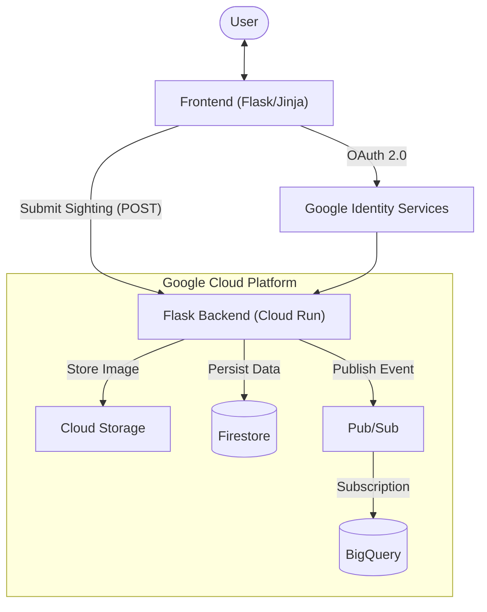

# 🐶 Dog Finder App - Serverless Codelab

Welcome to the **Building a Production-Ready Serverless App** Codelab repository! 

This repository contains the starter code and resources you will need to build and deploy a fully functional serverless application on Google Cloud. 

The application allows users to report lost dog sightings, capturing location data, dates, and photos. It leverages multiple Google Cloud services, including Cloud Run, Firestore, Cloud Storage, Pub/Sub, and BigQuery.

## 🚀 Getting Started

To get started with the codelab, please follow the step-by-step instructions provided in the [CODELAB.md](CODELAB.md) guide.

## 🏗️ Architecture Overview

## 🛠️ Repository Contents

- `app/`: The Flask backend and frontend templates.
- `schemas/`: Schemas for BigQuery and Pub/Sub.
- `scripts/`: Helper scripts for setting up resources, deploying, and cleaning up.
- `Dockerfile`: Container definition for Cloud Run.
- `requirements.txt`: Python dependencies.
- `CODELAB.md`: The complete codelab tutorial.

---
*Happy Coding!* ☁️
